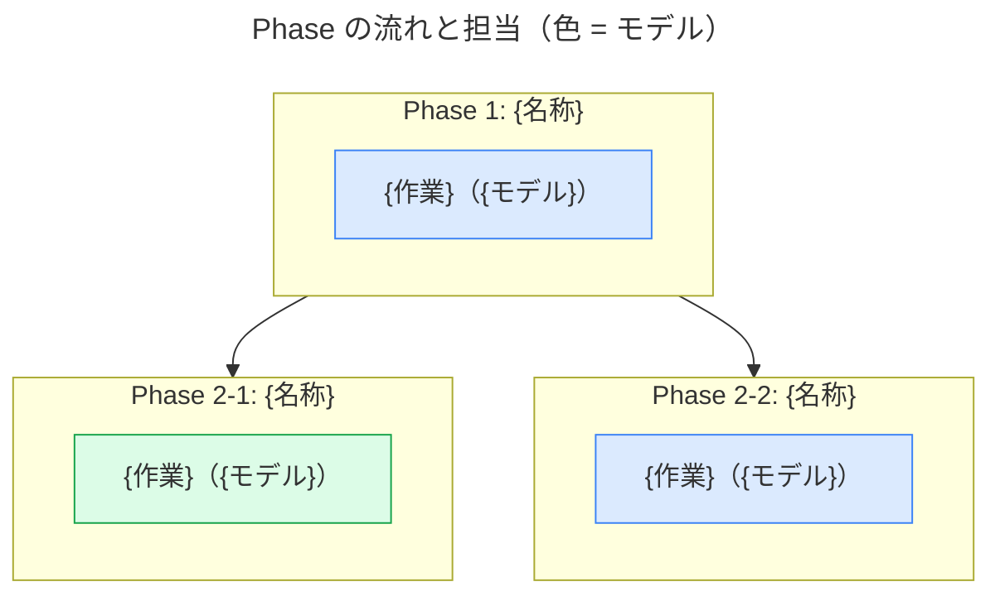

# プランガイド

ADR で確定した判断を実装に落とすための作業手順を、プランとして記述する。

## 目的

「なぜそう決めたか」を残す ADR に対し、プランは「どう作るか」を記述する。エージェントがそのまま実行できる粒度まで作業を分解し、実行前に人間がレビューするための発注書として機能させる。ブランチ・コミット・担当エージェントまで事前に申告し、実行後にリポジトリへ何が起きるかをレビュー時点で判断できるようにする。

プランは実装完了とともに役目を終える一時文書であり、恒久的な記録は ADR・コミット・コードが担う。

## 運用

- プランは `.tmp/plans/` 配下に 1 タスク 1 ファイルで置く。リポジトリにはコミットしない。
- ファイル名は ADR と同じ `YYYYMMDD-kebab-case-title.md` とする。日付はプランを作成した日を表す。
- 根拠となる ADR をファイル名で参照する。事前の設計判断を必要としない小規模タスクに限り ADR なしを許容し、その場合は `根拠:` を省略する。
- プランは相談で確定した事項のみで構成する。調査・検討のタスクを工程に入れず、必要な調査はプラン作成前に済ませ、結果は `前提` に確定値で書く。
- 作成したプランは `md-preview` で HTML 化して人間のレビューに供し、承認を得てから実行に入る。
- 実行中のチェックボックス更新や手順の具体化は自由に行う。判断が必要な論点が発覚したら、プラン内に書き溜めず作業を中断して相談に戻り、設計判断の変更なら ADR を追加してからプランを直す。修正したプランは再度 HTML 化してレビューを経てから実行を再開する。
- 完了条件をすべて満たしたらプランは削除する。実装を中止した場合も同様に削除し、中止に至った経緯や知見は ADR に残す。

## フォーマット

文書は h1 のタイトル 1 つで始める。h2 は `Goal`・`実行体制`・`Phase {番号}: {名称}` の 3 種で構成し、この順で書く。TOC は h2 のみを拾うため、この構成で目次がそのまま工程表になる。

- `Goal` — このプランで何が動くようになるかを 1〜2 文で述べ、根拠 ADR への参照を置く。配下に h3 を `完了条件` → `前提` → `スコープ外` の順で置く。
    - `完了条件` — Goal を達成したと判定する条件。チェックボックスで、テスト・lint・grep など機械的に確認できる形で書く。
    - `前提` — プラン作成前の調査・相談で確定した事実。参照箇所数などの具体値をここに置く。
    - `スコープ外` — やらないこと。後続プランとの境界線になる。
- `実行体制` — 作業ブランチ（分岐元とマージ先を含む）と、Phase を並行させる場合はその根拠を書く。並行する Phase も同一の作業ブランチ上で実施し、コミットは完了順に積むことを既定とする。ブランチを分ける場合は分岐と合流の方針をここに明記する。Phase の流れは Phase 数によらず mermaid で図示する。図は担当モデルを一目で確認する手段を兼ねるため、単一 Phase でも省略しない。
- `Phase {番号}: {名称}` — 作業のまとまり。並行して実施する Phase は `2-1` / `2-2` のように枝番で表し、枝番も `{番号}` の一部として扱う。名称には対象パスを括弧で添えてよく、mermaid のラベルでは括弧を省略してよい。配下に Step をチェックボックスで並べる。

Step は 1 コミットで完結する粒度とし、`担当`・`検証`・`コミット` の 3 点を必ず添える。

テンプレート:

````markdown
# {プランのタイトル}

## Goal

{何が動くようになるか。根拠: `YYYYMMDD-xxx.md`}

### 完了条件

- [ ] {機械的に確認できる条件}
- [ ] 全 Phase のチェックボックスが埋まっている

### 前提

- {事前調査・相談で確定した事実}

### スコープ外

- {やらないこと}

## 実行体制

- ブランチ: `{ブランチ名}`（`main` から分岐、完了チェック後に `main` へマージ）
- {並行実施する場合はその根拠}



## Phase 1: {名称}

- [ ] {Step}
    - 担当: {モデル}（{エージェント種別}）
    - 検証: {日本語の説明（`実行コマンド`）}
    - コミット: `{コミット件名}`

**{成果物の期待例のラベル}**

```sh
{期待する構造・出力の例。フェンスの言語指定は成果物に合わせて変える}
```

## Phase 2-1: {名称}

Phase 2-2 と並行して実施する。

- [ ] {Step（形式は Phase 1 と同じ）}

## Phase 2-2: {名称}

Phase 2-1 と並行して実施する。

- [ ] {Step（形式は Phase 1 と同じ）}
````

## 書き方

- 常体（〜である・〜とした）で書く。
- 固有名は日本語の説明を主、コマンド・パスを括弧の従として書く。「APIアプリのテスト（`just test apps/api`）が通る」のように、直感的に読める文にコマンドを添える。この規則は Phase 名と mermaid のノードラベルにも適用する（NG: `apps/api への組み込み` → 適切: `APIアプリへの組み込み`）。
- Step の本文には「何を作るか」だけを 1 文で書き、進め方や確認手順を本文に混ぜない。
- `検証` はエージェントがそのまま実行できるコマンドを含める。「動作確認する」のような抽象表現だけで済ませない。Step の `検証` は変更対象に閉じた確認を担い、全体の検収は `完了条件` が担う。
- TDD で進める Step は「テストを書く」を独立 Step にせず、`検証` に「先に失敗するテストを書く」旨を含めて 1 Step にまとめる。
- `担当` は「`sonnet`（general-purpose）」のように、プラン作成時点で利用可能な具体的なモデル名とサブエージェント種別で書く。メインエージェントが実施する場合の種別は「メイン」とする。別の担当がレビューする場合は「担当: `sonnet`（general-purpose）、置換結果を `fable` がレビュー」のように同じ行に添える。
- `コミット` は件名単体で内容が分かるように対象を明示する。書式はコミットメッセージガイドに従う。
- 文章では受け入れ像が伝わりにくい成果物（設定ファイルの構造、CLI 出力、エラーメッセージ、API レスポンスなど）は、Phase のチェックリスト直後に **太字ラベル** ＋コードブロックで期待例を示す。この例示は人間レビューと、実装するエージェントへの仕様伝達を兼ねるため、付けるかどうか迷う場合は付ける側に倒す。ただし期待例は外から観測できる振る舞い（出力・構造・応答）を示すものとし、実装の内部詳細まで書き込まない。
- `完了条件` はスコープの言い換えにしない。「何を作るか」ではなく「何が通れば終わりか」を書く。項目同士に包含関係を作らない（ワークスペース全体のテストを条件にするなら、それに含まれる個別パッケージのテストを並べない）。
- Step に設計判断を書かない。書く手が止まり選択肢を比較し始めたら、それは相談と ADR に戻すサインである。
- ファイル名・関数名・コマンド名などのコード識別子は必ずインラインコードにする。

## 図表

- `実行体制` の mermaid は subgraph を Phase、ノードをエージェントの作業単位とし、担当は「{作業}（{モデル}）」の形でラベルに含める。
- 使用するモデルごとに `classDef` を 1 つ定義してノードを色分けし、図の `title:` に「色 = モデル」の凡例を明記する。
- 並行する Phase は分岐と合流を矢印で表し、依存関係を図から読み取れるようにする。直列のみの構成は分岐のない一本の流れとして描く。
- ノードラベルに HTML タグを入れない。

## レンダリング互換性

プランは `md-preview` でそのまま HTML 化できる形式を保つ。ファイル冒頭の frontmatter は書かない。mermaid の制約（`title:` 必須・使用可能なダイアグラム種別）と Callout の書式は ADR ガイドと同じとする。

## チェック

初稿を書き終えたら、記述者自身が以下を確認して違反を修正し、HTML 化して人間のレビューに提出する。ADR ガイドの二段目の確認は、この人間レビューが兼ねる。

- [ ] h2 が `Goal`・`実行体制`・`Phase {番号}: {名称}` のみで構成されている
- [ ] `Goal` 配下の h3 が `完了条件` → `前提` → `スコープ外` の順である
- [ ] 調査・検討のタスクや未決の論点が工程に含まれていない
- [ ] 各 Step に `担当`・`検証`・`コミット` が揃い、`検証` に実行可能なコマンドが含まれている
- [ ] コミット件名が単体で内容の分かる粒度になっている
- [ ] 並行する Phase が枝番で表され、並行の根拠が `実行体制` にある
- [ ] `実行体制` に mermaid の Phase フロー図があり、subgraph = Phase・色 = モデルの規則に従い、`title:` があり、ノードラベルに HTML タグがない
- [ ] 文章では伝わりにくい成果物に期待例のコードブロックがある
- [ ] 固有名が日本語の説明を主、コマンド・パスを括弧の従として書かれている
- [ ] コード識別子がすべてインラインコードになっている
- [ ] `完了条件` が機械的に確認できる形で書かれている
